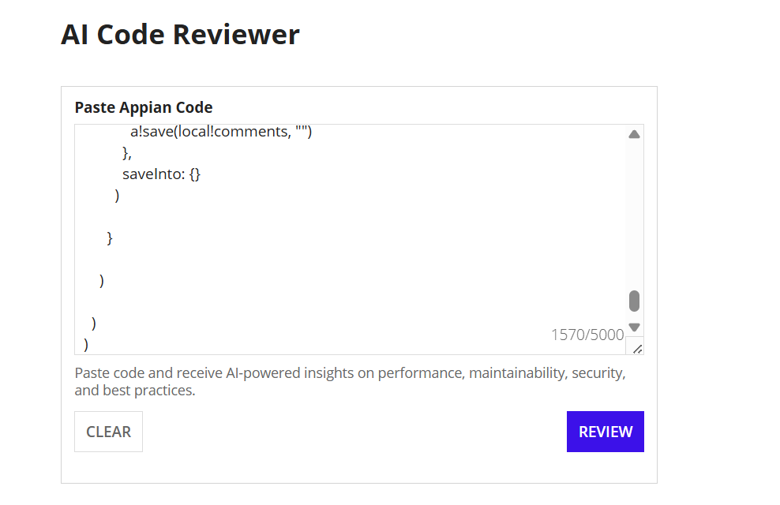
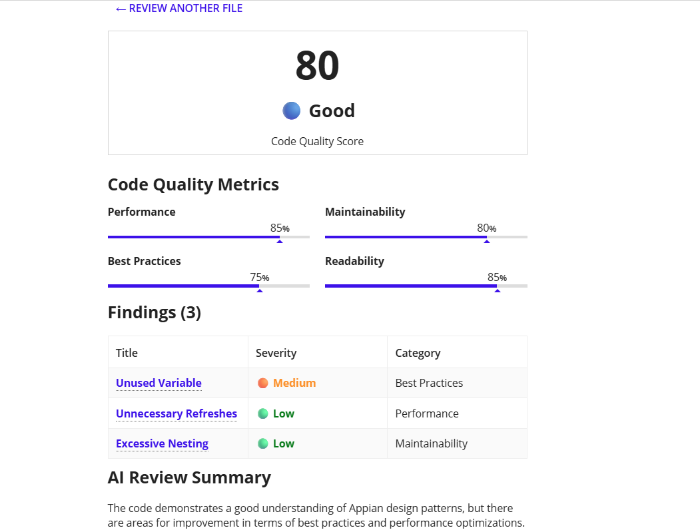
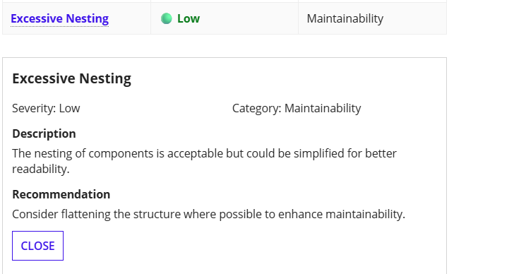

# AI-Powered Appian Code Review Assistant

An AI-powered code review assistant that analyzes **Appian SAIL code** and provides actionable feedback on **performance, maintainability, readability, and Appian best practices** using Large Language Models (LLMs).

> ⚡ Built to help Appian developers identify code issues, improve application performance, and accelerate code reviews.

---

## Demo

> 📹 Demo Video: https://www.linkedin.com/posts/apeksha-sharma-appian-dev_ai-generativeai-python-ugcPost-7475776002049064960-qC8a/?utm_source=share&utm_medium=member_desktop&rcm=ACoAACXyo8oBx855NdJAjkXfB6Phic6k_EOQr1Y

### Sample Review

Input:

```appian
a!localVariables(
  local!quoteInfo: rule!AS_qe_fetchVehicleData(
    Email: ri!UserName
  )
)
```

AI Findings:

* ✅ Avoid unnecessary Query Entity executions.
* ✅ Specify the `fields` parameter to fetch only required columns.
* ✅ Consider `fetchTotalCount: false` when total count is not required.
* ✅ Improve naming consistency for better readability.

---

# ✨ Features

* AI-powered Appian SAIL code analysis
* Performance optimization suggestions
* Appian best practice validation
* Maintainability and readability review
* Concise one-line findings
* Improvement recommendations
* Copy-friendly review output

---

# 🛠 Tech Stack

* Python
* FastAPI
* OpenAI API
* Appian SAIL
* Prompt Engineering

---

# 📂 Project Structure

```
appian-ai-code-reviewer/
│
app.py
requirements.txt
README.md
prompts/
utils/
sample_code/
screenshots/
assets/
```

---

# 🖥️ Screenshots

> *(Add screenshots here once available.)*

Example:

* Input Screen

* AI Findings


---

# 💡 Motivation

As an Appian developer, I noticed that code reviews often focus on functional correctness while missing opportunities for performance improvements and maintainability enhancements.

This project explores how Large Language Models can assist developers by automatically reviewing Appian SAIL code and providing practical suggestions based on established best practices.

The goal is **not to replace human reviewers**, but to act as an intelligent assistant that helps developers write cleaner and more efficient Appian applications.

---


# 🤝 Contributions

Contributions, suggestions, and feature requests are always welcome.

If you have ideas to improve the project, feel free to open an Issue or submit a Pull Request.

---

# ⭐ Support

If you find this project useful, consider giving it a ⭐ on GitHub.

It helps others discover the project and motivates further development.

---

# 👨‍💻 Author

**Apeksha Sharma**

* Lead Appian Developer
* AI Enthusiast
* Building AI applications with Python & LLMs

LinkedIn: https://www.linkedin.com/in/apeksha-sharma-appian-dev/

---

# 📄 License

This project is licensed under the MIT License.
